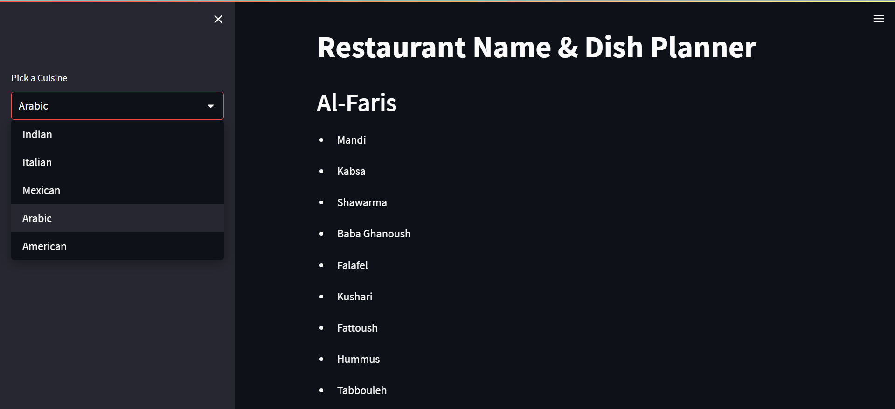

# 🍽️ AI Restaurant Name & Menu Generator



Welcome to the **AI Restaurant Name & Menu Generator** — a fun and creative tool that uses the power of **LLMs (Large Language Models)** to suggest **fancy restaurant names** and a **menu of traditional dishes** based on the cuisine you choose. Built using **LangChain**, **Together AI (Mistral-7B)**, and **Streamlit**.

---

## 🚀 Features

- 🎯 One-click generation of restaurant names based on cuisine
- 🧠 Smart and culturally accurate dish suggestions
- 🤖 Uses Together AI's `mistralai/Mistral-7B-Instruct-v0.1`
- 🔗 LangChain for chaining prompts with ease
- 🧩 Clean Streamlit interface
- 📜 Bullet-style output for clear presentation
- ⚡ Lightweight and easy to run

---

## 🧱 Project Structure

```
restaurant-ai-app/
├── main.py                # Streamlit UI code
├── langchain_helper.py   # All LLM + LangChain logic
├── secret_key.py          # API key for Together AI (ignored in Git)
├── requirements.txt       # Dependencies
├── README.md
└── project_screenshot.png # UI screenshot (for README)
```

---

## 🏗️ System Architecture

```
[ User selects Cuisine ] 
        ⬇
[ Prompt 1: Generate Restaurant Name ]
        ⬇
[ Prompt 2: Generate Menu using Name ]
        ⬇
[ Streamlit: Display Cleanly ]
```

---

## 🧠 Tech Stack

- **Streamlit** – UI interface
- **LangChain** – LLM prompt chaining
- **Together AI** – LLM inference (Mistral)
- **Python** – Backend logic

---

## 🧪 How It Works

### 1. User picks a cuisine (e.g., "Indian").

### 2. Prompt 1 (Restaurant Name):
```text
Suggest only one fancy name (no description or explanation) for a restaurant that serves {cuisine} food.
```

➡️ Output: `"The Royal Thali"`

### 3. Prompt 2 (Dish Menu):
```text
Suggest a list of traditional and popular {cuisine} dishes served at a restaurant named "{restaurant_name}".
Only return the dish names in bullet-point format.
```

➡️ Output:
- Butter Chicken  
- Paneer Tikka  
- Biryani  
- Chole Bhature

---

## 💻 Setup Instructions

### 1. Clone the repository
```bash
git clone https://github.com/your-username/restaurant-ai-app.git
cd restaurant-ai-app
```

### 2. Create and activate a virtual environment
```bash
python -m venv env
source env/bin/activate     # For macOS/Linux
env\Scripts\activate        # For Windows
```

### 3. Install the dependencies
```bash
pip install -r requirements.txt
```

### 4. Add your Together API key

Create a file called `secret_key.py`:
```python
Together_key = "your_actual_api_key"
```

> ✅ Make sure to include this in `.gitignore` so it doesn't get pushed to GitHub.

### 5. Run the Streamlit app
```bash
streamlit run main.py
```

---

## 🗂️ Code Overview

### 🔸 main.py
- Displays title and sidebar in Streamlit
- Lets users choose cuisine
- Calls `generate_restaurant_name_and_items()` from helper
- Displays restaurant name and list of dishes

### 🔹 langchain_helper.py
- Uses `PromptTemplate` and `Together` LLM
- First prompt → generates a name
- Second prompt → uses that name to generate menu
- Returns name and dishes as a dictionary

---

## 🖼️ Screenshot

```markdown

```

> Replace `project_screenshot.png` with an actual screenshot of the Streamlit UI.

---

## 🔐 Security Notes

- ✅ Your API key is stored in `secret_key.py`
- 🛑 Don’t upload your API key to GitHub!
- ✅ Add it to `.gitignore`:

```
secret_key.py
```

---

## 📋 Sample Output

**Cuisine:** `Mexican`  
**Restaurant Name:** `Casa del Sol`  
**Menu:**
- Tacos al Pastor  
- Enchiladas  
- Guacamole  
- Churros  
- Quesadillas

---

## 🛠️ Requirements

```
streamlit
langchain
langchain_together
together
```

> Add any other dependencies like `openai`, `dotenv`, etc. if used.

---

## 🧠 What You Learn

- LangChain’s `PromptTemplate` and chaining
- Streamlit for LLM UIs
- How to structure multi-step LLM pipelines
- Use of `Together` inference API
- Prompt engineering basics

---

## 🧭 Future Ideas

- Add image generation for dishes
- Let user control temperature/max tokens
- Add dish categories (Starter, Main, Dessert)
- Save results as downloadable PDF
- Integrate translations for global cuisine

---

## ✅ Conclusion

This project is a fun and creative introduction to real-world **LLM apps**. It teaches you:

- How to design multi-step LLM workflows
- How to chain prompts with LangChain
- How to integrate external LLMs like **Mistral-7B**
- And how to build a clean UI with **Streamlit**

🚀 Simple, smart, and useful — perfect for portfolios and demos.

---

## 🙌 Credits

- [LangChain](https://www.langchain.com/)
- [Together AI](https://www.together.ai/)
- [Mistral](https://mistral.ai/)
- [Streamlit](https://streamlit.io/)
